# 🏨 Hotel AI Email Agent

> An AI-powered email agent for hotel guest communications — built on [Claude](https://www.anthropic.com/claude) (Anthropic).  
> The agent reads inbound guest emails, queries a mock Property Management System, proposes a structured action plan, drafts a professional reply, and either executes the plan autonomously or holds for human approval — depending on configuration.

<br>


---

## Table of Contents

- [Overview](#overview)
- [Key Design Principles](#key-design-principles)
- [Architecture](#architecture)
- [Project Structure](#project-structure)
- [Quick Start](#quick-start)
- [Configuration](#configuration)
- [Running the Agent](#running-the-agent)
- [Demo Scenarios](#demo-scenarios)
- [Approval Modes](#approval-modes)
- [Skills vs Tools](#skills-vs-tools)
- [Write Actions](#write-actions)
- [What I'd Add Next](#whati'd-add-next)

---

## Overview

The Hotel AI Email Agent automates the most common guest email workflows for a hotel — new bookings, cancellations, modifications, and policy inquiries — while keeping a human in the loop for any request that carries financial or reputational risk.

**The core loop:**

1. A guest email arrives (CLI or web dashboard).
2. The AI reads the email, queries the Property Management System (PMS) using read-only tools, and builds a complete action plan.
3. The plan — a structured list of PMS write operations + a draft reply — is reviewed.
4. Depending on `APPROVAL_MODE`, either a staff member approves it or it executes automatically.
5. The PMS is updated and the reply is sent to the guest.

Write operations are **completely blocked during the planning phase**. The AI can only describe the actions it wants to take — it cannot execute them. This clean separation makes human approval a first-class architectural feature, not an afterthought.

---

## Key Design Principles

| # | Principle | Why It Matters |
|---|-----------|----------------|
| 1 | **Plan-first, execute-later** | Write tools don't exist during planning. The LLM produces a reviewable plan before anything is written to the PMS. |
| 2 | **`submit_plan` as the terminal tool** | The agent always ends planning by calling a structured tool — output is machine-readable JSON, not free-form text to parse. |
| 3 | **No AI arithmetic** | All pricing calculations live in Python (`pms.calculate_total()`). The LLM only quotes exact figures returned by tools — no hallucinated prices. |
| 4 | **Safety hardcoded, not prompted** | Non-refundable cancellations are flagged by Python code inside `skill_cancellation_lookup` — before the AI reasons about them. This gate cannot be bypassed even in autonomous mode. |
| 5 | **Read / write separation** | The executor (`executor.py`) is a pure Python layer with zero LLM involvement — deterministic, testable, and auditable. |
| 6 | **Availability re-check at execution time** | `create_reservation` re-checks room availability immediately before writing — prevents silent overbooking if inventory changed during human review. |
| 7 | **Night-based date logic** | Hotels sell *nights*, not days. `check_in=Apr-20, check_out=Apr-23` = 3 nights. `check_out` is always excluded from availability ranges. |

---

## Architecture

The diagram below traces a single guest email from inbox → reply. Follow the numbered nodes ① → ㉒.

```mermaid
flowchart LR
    %% ─── STYLES ───────────────────────────────────────────────
    classDef input      fill:#DBEAFE,stroke:#3B82F6,color:#1E3A5F,font-weight:bold
    classDef ui         fill:#E2E8F0,stroke:#64748B,color:#1E293B
    classDef init       fill:#DCFCE7,stroke:#22C55E,color:#14532D
    classDef ai         fill:#FEF9C3,stroke:#EAB308,color:#713F12,font-weight:bold
    classDef tools      fill:#FFEDD5,stroke:#F97316,color:#7C2D12
    classDef data       fill:#FEF3C7,stroke:#D97706,color:#78350F
    classDef plan       fill:#FEF9C3,stroke:#CA8A04,color:#713F12
    classDef gate       fill:#FEE2E2,stroke:#EF4444,color:#7F1D1D,font-weight:bold
    classDef exec       fill:#EDE9FE,stroke:#8B5CF6,color:#3B0764
    classDef output     fill:#CCFBF1,stroke:#14B8A6,color:#134E4A,font-weight:bold
    classDef decision   fill:#FEE2E2,stroke:#EF4444,color:#7F1D1D

    %% ─── INPUT ───────────────────────────────────────────────
    N1(["`✉️ **① Guest Email**
    sender + body`"]):::input

    %% ─── UI LAYER ────────────────────────────────────────────
    N2["`**② CLI**
    main.py
    interactive / demo / --mode`"]:::ui
    N3["`**③ Web Dashboard**
    app.py · Streamlit`"]:::ui

    %% ─── INIT ────────────────────────────────────────────────
    N4["`⚙️ **④ Config Loader**
    .env · API key
    APPROVAL_MODE · LLM_MODEL
    MOCK_CURRENT_DATE`"]:::init
    N5["`**⑤ PMS Loader**
    reads data file
    into memory`"]:::init

    %% ─── AI PLANNING LOOP ────────────────────────────────────
    N6["`**⑥ Agent Setup**
    HotelEmailAgent
    formats email
    builds system prompt`"]:::ai
    N7["`🤖 **⑦ Claude claude-haiku-4-5**
    AI Planning Engine
    ─────────────────
    🔁 loops up to 10×
    🔒 writes BLOCKED`"]:::ai
    N8["`**⑧ Tool Dispatcher**
    routes tool calls
    returns JSON to AI`"]:::ai

    %% ─── SKILLS ──────────────────────────────────────────────
    N9A["`⚡ **⑨a skill_booking_lookup**
    guest lookup +
    room search · 1 call
    → guest_is_new flag`"]:::tools
    N9B["`⚡ **⑨b skill_cancellation_lookup**
    guest + reservation +
    risk assessment · 1 call
    → requires_human_review`"]:::tools
    N9C["`⚡ **⑨c skill_guest_history**
    full profile +
    all reservations · 1 call`"]:::tools

    %% ─── ATOMIC TOOLS ────────────────────────────────────────
    N10["`**⑩ Atomic Read Tools**
    ────────────────────
    get_current_date
    get_hotel_info
    get_guest_by_email
    get_guest_reservations
    get_reservation_details
    search_available_rooms`"]:::tools

    %% ─── DATA ────────────────────────────────────────────────
    N11[("`🗄️ **⑪ PMS**
    pms.py
    ──────────────
    pricing · rules
    CRUD · persistence`")]:::data
    N12["`📄 **⑫ mock_hotel_data.json**
    4 room types · 4 rate plans
    guests · reservations`"]:::data

    %% ─── PLAN OUTPUT ─────────────────────────────────────────
    N13["`📋 **⑬ PlanResult**
    ─────────────────────
    action_plan [ ]
    draft_reply
    requires_human_review
    review_reason`"]:::plan

    %% ─── APPROVAL GATES ──────────────────────────────────────
    N14{"`⑭ requires_human
    _review?`"}:::decision
    N15["`🙋 **⑮ Escalate**
    no PMS changes
    holding reply surfaced
    to staff`"]:::gate
    N16{"`⑯ write
    actions?`"}:::decision
    N17{"`⑰ APPROVAL
    _MODE?`"}:::decision
    N18["`👤 **⑱ Staff Review**
    plan + draft shown
    waiting Y / N`"]:::gate

    %% ─── EXECUTOR ────────────────────────────────────────────
    N19["`⚙️ **⑲ Executor**
    executor.py
    ──────────────────
    🔄 NEW_GUEST resolve
    🛡️ availability re-check`"]:::exec
    N20["`**⑳ PMS Write Actions**
    ──────────────────────
    ⑳a create_guest
    ⑳b create_reservation
    ⑳c cancel_reservation
    ⑳d modify_reservation`"]:::exec
    N21["`**㉑ ExecutionResult**
    ✅ success per action
    ❌ failure with reason`"]:::exec

    %% ─── OUTPUT ──────────────────────────────────────────────
    N22(["`✉️ **㉒ Reply Sent**
    to guest`"]):::output

    REJECT(["`✋ Rejected
    no action`"]):::gate

    %% ─── EDGES ───────────────────────────────────────────────
    N1 --> N2
    N1 --> N3
    N2 --> N4
    N3 --> N4
    N4 --> N6
    N5 --> N11
    N6 --> N7
    N7 -->|calls tool| N8
    N8 -->|skill?| N9A
    N8 -->|skill?| N9B
    N8 -->|skill?| N9C
    N8 -->|atomic?| N10
    N9A --> N11
    N9B --> N11
    N9C --> N11
    N10 --> N11
    N11 <-->|read/write| N12
    N11 -.->|JSON result| N8
    N8 -.->|result injected| N7
    N7 -->|submit_plan| N13
    N13 --> N14
    N14 -->|YES| N15
    N14 -->|NO| N16
    N15 -.->|holding reply| N22
    N16 -->|NO writes| N22
    N16 -->|has writes| N17
    N17 -->|autonomous| N19
    N17 -->|human| N18
    N18 -->|approve| N19
    N18 -->|reject| REJECT
    N19 --> N20
    N20 --> N11
    N20 --> N21
    N21 --> N22
```



---

## Project Structure

```
hotel_ai_agent_demo/
│
├── main.py                     # CLI entry point — interactive, demo, and --mode flag
├── app.py                      # Streamlit web dashboard
├── requirements.txt
├── .env                        # Runtime configuration (API key, approval mode, etc.)
├── .streamlit/
│   └── config.toml             # Streamlit theme configuration (light mode)
│
├── data/
│   └── mock_hotel_data.json    # PMS data — room types, rate plans, guests, reservations
│
└── src/
    ├── __init__.py
    ├── config.py               # Environment-driven config (reads .env)
    ├── prompts.py              # System prompt template (hotel context + hard rules)
    ├── agent.py                # LLM planning loop → PlanResult
    ├── tools.py                # Tool schemas (Anthropic JSON) + read-tool dispatcher
    ├── skills.py               # Multi-step workflow skills (preferred over atomic tools)
    ├── executor.py             # Runs approved action_plan against PMS (write ops)
    └── pms.py                  # Mock PMS — all data access, mutations, and pricing
```

---

## Quick Start

### Prerequisites

- **Python 3.12** (required)
- An [Anthropic API key](https://console.anthropic.com/)

### Installation

```bash
# 1. Clone or unzip the project
cd hotel_ai_agent_demo

# 2. Create and activate a virtual environment (recommended)
python3.12 -m venv .venv
source .venv/bin/activate        # macOS / Linux
.venv\Scripts\activate           # Windows

# 3. Install dependencies
pip install -r requirements.txt

# 4. Configure environment
cp .env.example .env

# 5. Set up your Anthropic API Key
# 1. Go to https://console.anthropic.com/
# 2. Sign up and navigate to "API Keys"
# 3. Create a new key and copy it
# 4. Open .env and paste your key:
# ANTHROPIC_API_KEY=your-key-here
```

### 🗝️ Obtaining an API Key

To use the Grand Oslo Hotel Agent, you must have an active Anthropic API key:
1.  **Console Access**: Log into the [Anthropic Console](https://console.anthropic.com/).
2.  **Billing**: Ensure you have credits or a billing method attached (the agent uses [Claude 3.5 Haiku](https://www.anthropic.com/news/claude-3-5-haiku) by default).
3.  **Key Generation**: Go to the **API Keys** tab, generate a key, and copy it immediately (it won't be shown again).
4.  **Security**: Never commit your `.env` file or expose your key in public repositories.


### Launch the web dashboard

```bash
streamlit run app.py
# Opens at http://localhost:8501
```

---

## Configuration

All settings are read from environment variables or a `.env` file in the project root.

| Variable | Default | Description |
|---|---|---|
| `ANTHROPIC_API_KEY` | *(required)* | Your Anthropic API key |
| `APPROVAL_MODE` | `human` | `human` — waits for Y/N approval · `autonomous` — executes immediately |
| `MOCK_CURRENT_DATE` | `2025-04-18` | The agent's "today" — used for cancellation window logic and relative date resolution |
| `LLM_MODEL` | `claude-haiku-4-5` | Anthropic model to use for the planning loop |
| `LLM_MAX_TOKENS` | `2048` | Max tokens per LLM response |
| `AGENT_MAX_ITERATIONS` | `10` | Safety cap on the planning loop |

---

## Running the Agent

### Interactive mode — type any guest email

```bash
python main.py
# Prompts for: sender email address, then email body
```

### Override approval mode at runtime

```bash
python main.py --mode autonomous   # execute plans immediately
python main.py --mode human        # always wait for Y/N approval
```

---

## Demo Scenarios

| Demo | Intent | PMS Writes | Outcome |
|------|--------|-----------|---------|
| `--demo 1` | *"Do you have rooms Apr 20–22 for 2 adults?"* | None | Informational reply with availability + pricing |
| `--demo 2` | *"Book a double with breakfast, Apr 20–22, Sophie Müller"* | `create_guest` + `create_reservation` | Booking confirmed, reply sent |
| `--demo 3` | *"Cancel RES002 and refund me — non-refundable rate"* | None (blocked) | Escalated to human review — no automated refund |

---

## Approval Modes

```

APPROVAL_MODE=autonomous   →  Plan executed immediately after planning completes
APPROVAL_MODE=human        →  Plan displayed to staff → waiting for Y/N → execute if approved
Either mode               →  If requires_human_review=True, ALWAYS escalates — no automated execution
```

> **Note:** The `requires_human_review` flag is evaluated in Python code inside `skill_cancellation_lookup` — it cannot be overridden by prompt injection or model output.

---

## Skills vs Tools

The agent has access to two layers of read-only data access. **Skills are always preferred** — they combine multiple PMS lookups into a single AI call and enforce business rules in code.

### Skills — preferred

| Skill | When to use | What it does |
|-------|-------------|--------------|
| `skill_booking_lookup` | Guest wants a **new reservation** | Guest lookup + room availability search in one call. Returns `guest_is_new` flag and all available rooms with pricing. |
| `skill_cancellation_lookup` | Guest wants to **cancel or get a refund** | Guest lookup + reservation details + Python risk assessment. Returns `requires_human_review` pre-computed — the AI copies it directly into `submit_plan`. |
| `skill_guest_history` | Guest references *"my booking"* without an ID | Full guest profile + all reservations enriched with room/rate names. |

### Atomic read tools — fallback only

| Tool | Purpose |
|------|---------|
| `get_current_date` | Resolves relative dates: *"next week"*, *"this weekend"*, cancellation windows |
| `get_hotel_info` | Returns all hotel policies: breakfast, parking, pets, cancellation terms |
| `get_guest_by_email` | Looks up a guest profile by email address |
| `get_guest_reservations` | Returns all reservations for a given guest ID |
| `get_reservation_details` | Returns full enriched details for one specific reservation |
| `search_available_rooms` | Returns available room types + all rate plan options for given dates and occupancy |

---

## Write Actions

Write actions are **only available to the Executor** — never to the planning-phase LLM. The four supported actions, executed in dependency order:

| Action | Key Parameters | Notes |
|--------|---------------|-------|
| `create_guest` | `first_name`, `last_name`, `email`, `phone` | Generates a new guest ID. Must run before `create_reservation` for new guests. |
| `create_reservation` | `guest_id`, `room_type_id`, `rate_plan_id`, `check_in`, `check_out`, `adults` | **Re-checks availability immediately before writing** — prevents overbooking. Accepts `"NEW_GUEST"` as a `guest_id` placeholder. |
| `cancel_reservation` | `reservation_id` | Updates status, restores room inventory for cancelled nights. |
| `modify_reservation` | `reservation_id` + any of: `check_in`, `check_out`, `adults`, `rate_plan_id` | Patches the specified fields, recalculates the total price. |

> **`NEW_GUEST` placeholder:** When a new guest must be created before a reservation, the AI uses the string `"NEW_GUEST"` as the `guest_id` in `create_reservation`. The Executor substitutes the real ID produced by the preceding `create_guest` action at runtime.

---

## What I'd Add Next

<details>
<summary><strong>1. Persistent storage</strong></summary>
Replace the in-memory PMS with a real database (SQLite for dev, PostgreSQL for production). Add optimistic locking on availability rows to handle concurrent bookings safely.
</details>

<details>
<summary><strong>2. Confidence scoring on `requires_human_review`</strong></summary>
A second, cheaper LLM call could verify the flag using a simple classifier prompt — *"does this plan involve financial risk?"* — before execution, as an additional safety layer on top of the Python rule.
</details>

<details>
<summary><strong>3. Streaming responses</strong></summary>
Stream the LLM's tool calls and reply draft to the terminal / UI in real time rather than waiting for the full response. Significantly improves perceived latency on longer tool chains.
</details>

<details>
<summary><strong>4. Conversation threading</strong></summary>
Thread multiple emails from the same guest into a single conversation context, so the agent retains history — *"we already discussed your check-in date"* — without re-fetching.
</details>

<details>
<summary><strong>5. Real email integration</strong></summary>
Add an IMAP poller and SMTP sender. The mock `send_email()` call in `main.py` and the Streamlit display in `app.py` are the only two places that would need to change.
</details>

<details>
<summary><strong>6. Audit log</strong></summary>
Persist every `PlanResult` and `ExecutionResult` to a log table with timestamps, approval decisions, and the full tool-call trace. Essential for debugging, compliance, and dispute resolution.
</details>

<details>
<summary><strong>7. Structured output validation</strong></summary>
Use `instructor` or Pydantic model validation on the `submit_plan` arguments to catch schema violations before they reach the executor.
</details>

---

## Rate Plans

Four rate plans are available across all bookable room types:

| Plan ID | Name | Cancellation Policy | Notes |
|---------|------|--------------------|----|
| `RP001` | Standard | Free cancellation up to 24h before check-in | First night charged if cancelled late |
| `RP002` | Breakfast Included | Free cancellation up to 24h | Adds 250 NOK/person/night |
| `RP003` | Flexible | Free cancellation up to 7 days before check-in | 50% charge within 7 days |
| `RP004` | Non-Refundable | No cancellation | Lowest price — full charge at booking |

---

## Room Types

| Room ID | Name | Max Occupancy | Base Rate |
|---------|------|--------------|-----------|
| `RT001` | Standard Single | 1 adult | 1,200 NOK/night |
| `RT002` | Standard Double | 2 adults | 1,800 NOK/night |
| `RT003` | Superior Double | 3 guests | 2,500 NOK/night |
| `RT004` | Junior Suite | 3 guests | 3,800 NOK/night |

*All prices in NOK · Extra bed available in Superior Double and Junior Suite (400 NOK/night)*

---

<div align="center">

**Hotel AI Email Agent** · Built with [Claude](https://www.anthropic.com/claude) by Anthropic · Python 3.12

</div>